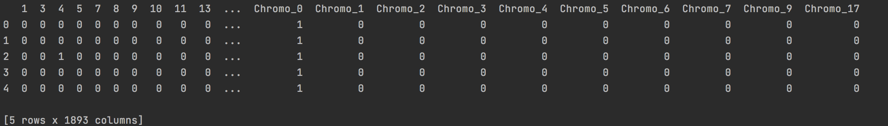
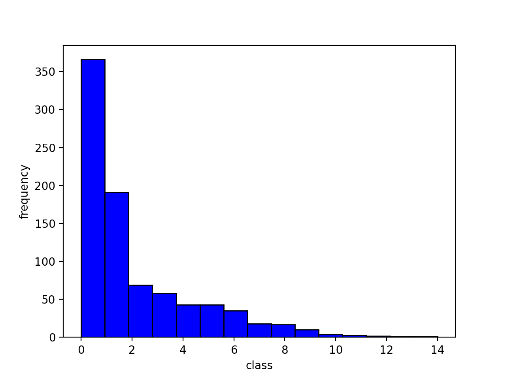
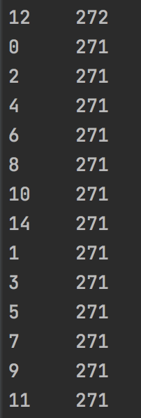
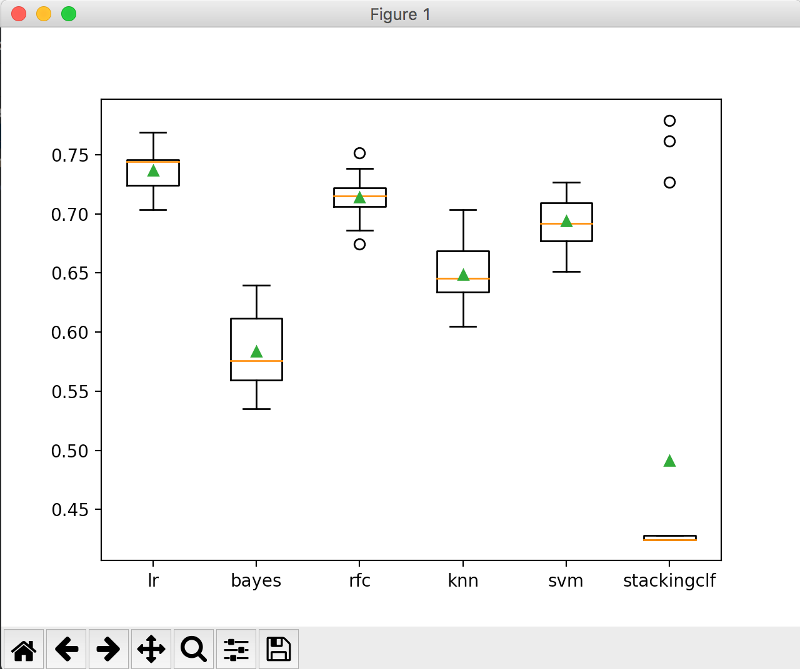

# UnderGraduateProject-Protein-Classifier

This repository presented my undergraduate proect of classifying protens into one of 15 classes using machine learning models. The project involves steps of Read Protein Dataset, Preprocess Data, Handle Imbalanced Data, Apply Machine Learning Classifers, Stacking.

## Steps In Detail

### Read Protein Dataset

- Import the dataset with pd.read_csv
- Set the last column to be the label column, columns before to be the features columns
- The label column ranges from 0-14, and there are 2961 features columns before preprocessing
- Split the dataset to 25% test data, 75% train data

### Preprocess Data

- Drop all columns with only NaNs
- Fill NaN with medium for numeric columns
- Fill NaN with the most frequent value for categorical columns
- Encode yes/no to 1/0 for columns(Class, Complex, Phenotype, Motif)
- Apply one-hot encoding for columns(Essential, Interaction, Chromosome)
- Drop columns which contain only one distinct value
  
Now the dataset only consist with 1/0, by printing the first few columns, the dataset looks like



By plotting the histogram of the label, we see that the dataset is highly imbalanced.



Thus our next step is to resample the dataset.

### Handle Imbalanced Data

- Since class 11, 12, 14 only have 1, 2, 1 data, we use oversample to generate data for class 11, 12, 14
- We use SMOTE to generate new and synthetic data for class 0-10

By plotting the label table, we see each class has 271 data. Now we are good to apply algorithms.



Here I will apply

- Random Forest Classifier
- K-Nearest Neighbor Classifier
- Support Vector Machine
- Gradient Boosting Machines
- XGBoost
- Stacking Classifier

#### Random Forest Classifer

Hyperparameters:

- Number of trees in random forest
- Number of features to consider at every split
- Maximum number of levels in tree
- Minimum number of samples required to split a node
- Minimum number of samples required at each leaf node

I corss validated the hyperparameter grid and obtained the following parameter values that maximizes the Testing accuracy score

```
{'n_estimators': 700, 'min_samples_split': 10, 'min_samples_leaf': 2, 'max_features': 'sqrt', 'max_depth': 60}
Training dataset accuracy score:  0.9728590250329381
Testing dataset accuracy score:  0.7222222222222222
```

#### K-Nearest Neighbor Classifier

Hyperparameters:

- Weights
- Number of neighbors
- Power parameter for the Minkowski metric

After Grid Search Cross Validation, the tuned hyperparameter values and accuracy scores are

```
{'n_neighbors': 2, 'p': 1, 'weights': 'distance'}
Training dataset accuracy score:  0.9994729907773386
Testing dataset accuracy score:  0.6759259259259259
```

#### Support Vector Machine

Hyperparameters:

- C
- gamma

After Grid Search Cross Validation, the tuned hyperparameter values and accuracy scores are

```
{'C': 10, 'gamma': 0.1, 'kernel': 'rbf'}
Training dataset accuracy score:  0.9989459815546772
Testing dataset accuracy score:  0.7175925925925926
```

#### Gradient Boosting Machines

Hyperparameters:

- Learning Rate
- Number of estimators

Gradient Boosting algorithm took so long to run that I have to terminate the program.
The reason can be found [here](https://stats.stackexchange.com/questions/144897/gradientboostclassifiersklearn-takes-very-long-time-to-train)

#### XGBoost

Hyperparameters:

- Learning Rate
- Maximum tree depth
- Gamma
- Lambda

After Grid Search Cross Validation, the tuned hyperparameter values and accuracy scores are

```
{'max_depth': 6, 'lambda': 0.5, 'gamma': 5, 'eta': 0.5}
Training dataset accuracy score:  0.9675889328063241
Testing dataset accuracy score:  0.6944444444444444
```

#### Stacking

The StackingClassifier is defined by first choosing 5 base models, then defining the Logistic Regression metal model to combine the predictions obtained from the base models using 5-fold cross-validation. Here I chose 5 base models to be Logistic Regression, Naive Bayes, Random Forest, KNN, and SVC. After evaluating the models using cross-validation, the box plot of the accuracy scores looks like



From the boxplot, we see Logistic Regression performed the best on the data. The next one is Random Forest Classifier, as we found previously. We see StackingClassfier performed weirdly here. Some records showed a pretty high prediction, while some are low. I think it might due to the high imbalance of the dataset I used to train the model on.

### Conclusion

We see that Random Forest algorithm gave the highest prediction accuracy score.

This is probably because Decision Tree performs well on imbalanced data.

I also have high expectation on XGBoost algorithm. Since XGBoost also takes super long to run,

I tuned hyperparameters only based on 2 iterations. I believe the score will be higher with more trials on hyperparameters.

I also conluded that preprocessing the data is the most important step in improving the performance of machine learning models.

I did this project twice, and by carefully preprocessed the data in the second time,

the prediction score on testing data is 4-6% higher than the first trial.

### Reference

- https://towardsdatascience.com/feature-engineering-for-machine-learning-3a5e293a5114
- https://towardsdatascience.com/methods-for-dealing-with-imbalanced-data-5b761be45a18
- https://towardsdatascience.com/understanding-random-forest-58381e0602d2
- https://towardsdatascience.com/hyperparameter-tuning-the-random-forest-in-python-using-scikit-learn-28d2aa77dd74
- https://medium.com/@ODSC/optimizing-hyperparameters-for-random-forest-algorithms-in-scikit-learn-d60b7aa07ead
- https://medium.com/analytics-vidhya/evaluating-a-random-forest-model-9d165595ad56
- https://towardsdatascience.com/knn-in-python-835643e2fb53
- https://www.datasciencelearner.com/gradient-boosting-hyperparameters-tuning/
- https://machinelearningmastery.com/gentle-introduction-gradient-boosting-algorithm-machine-learning/
- https://xgboost.readthedocs.io/en/latest/parameter.html
- https://www.analyticsvidhya.com/blog/2016/03/complete-guide-parameter-tuning-xgboost-with-codes-python/
